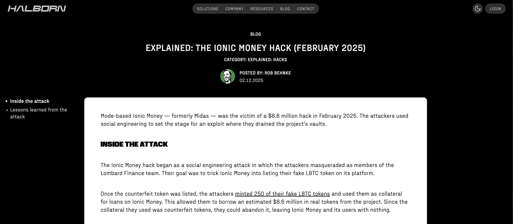
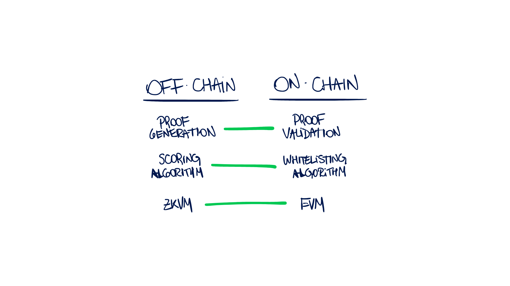

# Zk Trust

Zero-knowledge proof based trust system.



## References

- [Top 50 DeFi Hacks](https://www.halborn.com/reports/top-50-defi-hacks)
- [Explained: The Ionic Money Hack (February 2025)](https://www.halborn.com/blog/post/explained-the-ionic-money-hack-february-2025)
- [ZK Trust](https://www.zktrust.io/)
- [Etherscan API](https://docs.etherscan.io/getting-started/viewing-api-usage-statistics)
- [CoinMarketCap API](https://coinmarketcap.com/api/documentation/v1/?ref=defiplot.com)
- [Running Anvil](https://github.com/MartinCastroAlvarez/anvil-of-fury/tree/main)

## Problem

The *Ionic Money Hack* of *February 2025* is a significant security breach where attackers successfully stole $8.6 million by exploiting vulnerabilities in the project's digital security framework. The attack was orchestrated through a sophisticated social engineering strategy where the perpetrators posed as the *Lombard Finance* team. They convinced *Ionic Money* to list a counterfeit token, *LBTC*, on their platform.

Once the fake *LBTC* token was listed, the attackers exploited this by minting 250 of these counterfeit tokens to use as collateral to secure loans on the *Ionic Money* platform. The loans allowed them to extract an equivalent value of $8.6 million in legitimate tokens. As the *LBTC* tokens were counterfeit, the attackers left no value behind, effectively leaving *Ionic Money* and its users to bear the loss.

Post-theft, the stolen funds were moved across blockchain networks using cross-chain bridges to *Ethereum*, where they were laundered through the Tornado Cash mixer, complicating the traceability of the stolen assets.

## Solution



To address security vulnerabilities similar to those exploited in the *Ionic Money Hack*, implementing a *Zero Knowledge Proof (ZKP)* mechanism offers a robust solution by verifying critical attributes of a token before it's listed on a platform. This cryptographic technique enhances the reliability of tokens used within a lending and borrowing ecosystem.

The first step involves defining the metrics for token validation, which include the creation date of the token, ensuring it has been active for a substantial period, the number of unique token holders, high liquidity and consistent trading volume, and regular token contract interactions. These metrics are crucial to establish the legitimacy and market acceptance of the token.

For the actual computation of these metrics, at least three independent and reputable vendors should be engaged. These vendors will execute the necessary computations off-chain, analyzing blockchain data related to the token to compute scores based on the predefined metrics. The role of these vendors is crucial as they ensure that the assessment is unbiased and accurate without directly interacting with on-chain processes.

A ZKP circuit is then developed where these vendors can compute scores based on the token's attributes without revealing specific data points. This setup maintains privacy and prevents data manipulation. The circuit produces a proof that verifies whether the computed score and the corresponding token attributes meet the established criteria.

The crucial on-chain component involves a Solidity smart contract designed to verify the ZKP emitted by the off-chain computation. This contract checks the authenticity of the proof and ensures that the score meets or exceeds a predefined threshold. Tokens that pass the ZKP verification are automatically whitelisted and can thus be used as collateral within the platform. This whitelist is managed dynamically, with tokens being added or removed based on ongoing evaluations.

This integration between on-chain and off-chain processes ensures that the heavy computations do not burden the blockchain, while still maintaining rigorous standards for token verification. Vendors perform the significant computations off-chain and generate ZKPs, which are then verified by the on-chain smart contract that updates its logic and threshold settings periodically to adapt to new market conditions and emerging threats. This method not only secures the platform from similar attacks but also establishes a scalable and efficient framework for ongoing token validation.

## Setup

This project uses Python Poetry to manage dependencies.

```bash
poetry install
```

Start Anvil:

```bash
curl -L https://foundry.paradigm.xyz | bash
bash
foundryup
anvil
```

Install Foundry dependencies:

```bash
forge install foundry-rs/forge-std
```

## Build

Install ZoKrates: This tool is typically used in a Docker environment.

```bash
docker run -ti -v $(pwd)/krates:/home/zokrates/krates zokrates/zokrates /bin/bash
```

Compile your program.

```bash
cd krates
zokrates compile -i computation.zok
```

Generate the verification key to `verification.key`.

```bash
zokrates setup
```

Inspect the `verification.key` file.

```bash
cat verification.key
```

Export the verifier Solidity contract to `verifier.sol`.

```bash
zokrates export-verifier
```

Inspect the `verifier.sol` file.

```bash
cat verifier.sol
```

## Deployment

```bash
forge script ./Deploy.sol --rpc-url http://127.0.0.1:8545 --private-key 0xac0974bec39a17e36ba4a6b4d238ff944bacb478cbed5efcae784d7bf4f2ff80 --broadcast
```
```bash
[⠊] Compiling...
[⠢] Compiling 16 files with Solc 0.8.28
[⠆] Solc 0.8.28 finished in 1.13s
Compiler run successful!
Script ran successfully.
[...]
✅  [Success] Hash: 0xe6a5f522ca3fdbf97acac6b04c07a8b42852a91d9ffad1b99a96819cba117544
Contract Address: 0x5FC8d32690cc91D4c39d9d3abcBD16989F875707
Block: 1
Paid: 0.001234332001234332 ETH (1234332 gas * 1.000000001 gwei)
[...]
```

Export the contract ABI:

```bash
cat out/verifier.sol/Verifier.json | jq -r '.abi' > krates/verifier.abi
```

## Testing

Compute the witness for your specific inputs.

```bash
zokrates compute-witness -a 5 2 365 1 100000 1000000 10000000 1
```

Generate a cryptographic proof to `proof.json`.

```bash
zokrates generate-proof
```

Inspect the `proof.json` file.

```bash
cat proof.json
```

Run the Python script that generates the proof off-chain and verifies it on-chain.
Make sure you use a private key generated by Anvil, and the correct API keys for Etherscan and CoinMarketCap.
Also, the verifier contract address should be the one deployed in the previous step.

```bash
poetry run python3 trust.py \
    --private-key 0xac0974bec39a17e36ba4a6b4d238ff944bacb478cbed5efcae784d7bf4f2ff80 \
    --etherscan-api-key *********************** \
    --coinmarketcap-api-key *********************** \
    --target-contract-address 0xdAC17F958D2ee523a2206206994597C13D831ec7 \
    --verifier-contract-address 0x5FC8d32690cc91D4c39d9d3abcBD16989F875707 \
    --ethereum-rpc-url http://127.0.0.1:8545
```

This should return `True`, thus indicating that the proof is valid.

```bash
Certified: True  # Our off-chain score is certified by the on-chain contract
Score:  0.9712531567138239  # The contract should be trusted/whitelisted
Contract address:  0xdAC17F958D2ee523a2206206994597C13D831ec7  # USDT
```
